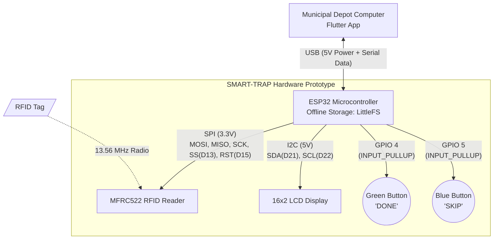

# SMART-TRAP Hardware Prototype Report

## 1. Prototype Overview
This document details the working and component architecture of the SMART-TRAP ESP32 hardware prototype. 

The device is designed for offline RFID scanning by sanitation workers. It is completely bus-powered, meaning it uses **no external battery**. It operates exclusively over a USB connection when plugged into a Municipal Depot Computer, handling both power delivery and serial data synchronization.

*(Note: Please rename the image you uploaded to `prototype_image.jpg` and place it in the `docs` folder, or update the path above).*

## 2. Hardware Components

The prototype consists of the following modular components:

1. **ESP32 Development Board**: The core microcontroller handling logic, offline storage (LittleFS), and USB Serial communication.
2. **MFRC522 RFID Reader**: Communicates over SPI (3.3V) to read worker/bin ID tags.
3. **16x2 Character LCD (with I2C Backpack)**: Provides visual feedback to the user, using only 4 wires (5V, GND, SDA, SCL).
4. **Action Buttons (Green & Blue)**: 
   - **Green Button**: Confirms a successful action ("DONE").
   - **Blue Button**: Indicates a skipped or incomplete action ("SKIP").

## 3. System Architecture

The following diagram illustrates how the components are connected and the flow of data.

## 4. Operational Workflow

Because the prototype operates over USB without an independent power source, its workflow is optimized for depot-station use:

### A. Initialization
- The device is plugged into the Municipal Depot Computer via USB.
- The ESP32 boots up, initializes the I2C display, SPI bus, and mounts the internal LittleFS filesystem.

### B. Scanning Process
- The LCD prompts the user with "Ready to Scan...".
- The worker presents an RFID tag to the MFRC522 reader.
- The ESP32 captures the unique Tag UID and awaits user input.

### C. Status Confirmation
- The LCD updates to prompt the user: `Grn:DONE Blu:SKP`.
- The worker presses either the **Green Button** (Success) or the **Blue Button** (Skipped).
- The ESP32 generates an HMAC signature for security and appends the record (UID + Status + Timestamp) locally to LittleFS as a JSON line.

### D. Data Synchronization
- The **Flutter Desktop App** running on the Depot Computer connects to the ESP32 over the USB Serial Port.
- The App sends a `DUMP` command.
- The ESP32 streams all stored offline records from LittleFS over Serial.
- The App parses the data and syncs it with the **PocketBase Backend**.
- Upon successful sync, the App sends a `CLEAR` command to wipe the ESP32's memory for the next use.
