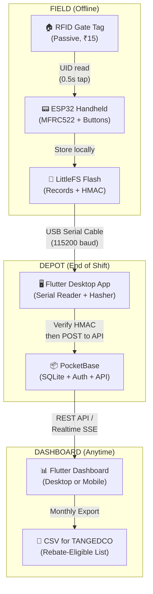

# SMART-TRAP System — Revised Implementation Plan

Minimal tech stack. ESP32 connects locally via USB to the municipal depot machine. Flutter app acts as the bridge. PocketBase is the entire backend.

---

## How the Whole System Works (End-to-End)

Here is the complete lifecycle, from doorstep scan to EB bill credit, in plain terms:

### During the Shift (Offline — No Internet Needed)

1. Sanitation worker walks their daily route carrying the **ESP32 handheld scanner**.
2. At each house, the scanner **reads the passive RFID gate tag** (0.5 second tap → gets the tag's unique UID).
3. Worker inspects the bins and presses the **GREEN** button (sorted correctly) or **RED** button (mixed/contaminated).
4. The ESP32 **creates a record** in its local flash memory:
   ```
   {
     scanner_id: "SCN-014-003",
     tag_uid:    "0xE0040150A9B2C1D4",
     timestamp:  1787654400,
     status:     1,             // 1 = GREEN, 0 = RED
     hmac:       "a3f8c1..."    // Tamper-proof hash of the above fields
   }
   ```
5. This repeats for every house on the route. The device stores **hundreds of records** offline in LittleFS flash — no WiFi, no SIM card, no internet needed during the shift.

### End of Shift (Wired Sync at the Municipal Depot)

6. Worker returns to the **ward depot office** and **plugs the ESP32 into the depot computer via USB cable**.
7. The **Flutter desktop app** running on the depot computer detects the device on the serial port.
8. The ESP32 dumps all stored records as a JSON batch over the USB serial connection.
9. The Flutter app **reads each record**, then for every record:
   - Retrieves the scanner's secret key from PocketBase.
   - **Recalculates the HMAC hash** from the payload fields.
   - **Compares** the recalculated hash with the hash sent by the ESP32.
   - If they match → the record is **authentic** (not tampered with). It gets inserted into PocketBase.
   - If they don't match → the record is **flagged as tampered** and logged for investigation.
10. After successful upload, the Flutter app sends a `CLEAR` command back over USB. The ESP32 wipes its flash for the next shift.

### Monthly Billing Cycle (Automatic)

11. PocketBase now holds all verified scan records, each linked to a property via the RFID tag UID → EB Service Connection Number mapping.
12. At month's end, the Flutter dashboard calculates each property's **Compliance Score**:
    ```
    Score = (GREEN days ÷ Total collection days) × 100
    ```
13. Properties with Score ≥ 80% are flagged **"Rebate Eligible"**.
14. The system exports a CSV/report for TANGEDCO to apply 3–5% credit on the next EB bill.

---

## How the ESP32 Works Locally (Wired Connection)

> [!IMPORTANT]
> **No WiFi/Cloud during field operations.** The ESP32 does NOT connect to any network while in the field. It operates fully offline. Data only leaves the device when it is physically plugged into the depot computer via USB.

### Physical Setup

```
┌─────────────────────┐         USB Cable          ┌──────────────────────────────┐
│   ESP32 HANDHELD    │ ========================== │   MUNICIPAL DEPOT COMPUTER   │
│                     │    (Serial @ 115200 baud)   │                              │
│  • MFRC522 RFID     │                             │  • Flutter Desktop App        │
│  • 2× Buttons       │                             │  • PocketBase (runs locally)  │
│  • LittleFS Flash   │                             │  • SQLite DB (inside PB)      │
│  • Li-Ion Battery   │                             │                              │
└─────────────────────┘                             └──────────────────────────────┘
```

### Serial Communication Protocol

The ESP32 and the Flutter app communicate over **USB Serial (UART)** at **115200 baud** using a simple text-based protocol:

| Direction | Command | Payload | Purpose |
|---|---|---|---|
| **Flutter → ESP32** | `PING\n` | — | Check if device is connected and ready |
| **ESP32 → Flutter** | `PONG\n` | — | Acknowledge connection |
| **Flutter → ESP32** | `DUMP\n` | — | Request all stored records |
| **ESP32 → Flutter** | `DATA:{json}\n` | JSON record | One record per line |
| **ESP32 → Flutter** | `END\n` | — | All records sent |
| **Flutter → ESP32** | `CLEAR\n` | — | Wipe flash after successful upload |
| **ESP32 → Flutter** | `CLEARED\n` | — | Acknowledge flash wipe |
| **Flutter → ESP32** | `COUNT\n` | — | Get number of stored records |
| **ESP32 → Flutter** | `COUNT:{n}\n` | Integer | Number of records in flash |

### Sync Flow (Step-by-Step Serial Exchange)

```
Flutter App                           ESP32
    |                                   |
    |--- PING\n ----------------------->|
    |<-- PONG\n ------------------------|
    |                                   |
    |--- COUNT\n ---------------------->|
    |<-- COUNT:147\n -------------------|
    |                                   |
    |--- DUMP\n ----------------------->|
    |<-- DATA:{"scanner_id":"SCN-014",  |
    |     "tag_uid":"0xE004...",         |
    |     "timestamp":1787654400,       |
    |     "status":1,                   |
    |     "hmac":"a3f8c1..."}\n --------|
    |<-- DATA:{...}\n ------------------|
    |    ... (147 records) ...          |
    |<-- END\n -------------------------|
    |                                   |
    | [Flutter verifies all HMACs]      |
    | [Flutter uploads valid to PB]     |
    |                                   |
    |--- CLEAR\n ---------------------->|
    |<-- CLEARED\n ---------------------|
    |                                   |
```

---

## Technology Stack (Minimal)

Only **3 technologies** in the entire system:

| Layer | Technology | Why |
|---|---|---|
| **Hardware** | **ESP32** (C++ / Arduino IDE) | ₹350 per unit. Built-in flash, hardware crypto, USB serial. Runs offline on battery. No SIM card. |
| **Backend** | **PocketBase** (single binary) | Zero-config backend. Embedded SQLite database, built-in auth, REST API, realtime subscriptions, admin UI — all in **one 15MB executable**. No PostgreSQL, no Docker, no server setup. Runs on the depot computer itself. |
| **Frontend** | **Flutter** (Dart) | Single codebase for the depot **desktop app** (Windows/Linux) AND an optional **mobile app** for supervisors. Handles USB serial reading + PocketBase SDK built-in. |

### Why This Stack

> [!TIP]
> **PocketBase replaces 4 separate tools** from the previous plan:
> - ~~PostgreSQL~~ → PocketBase's embedded SQLite
> - ~~FastAPI / Express~~ → PocketBase's built-in REST API
> - ~~JWT auth system~~ → PocketBase's built-in auth
> - ~~Admin panel~~ → PocketBase's built-in admin UI
>
> You download one file, run it, done. The entire backend fits on a USB stick.

---

## System Architecture



---

## Hash Verification (How Tamper-Proofing Works)

The HMAC system ensures that **nobody can modify records** on the ESP32's flash (e.g., changing REDs to GREENs) between the field scan and the depot upload.

### How It Works

1. **Provisioning (One-Time Setup):**
   Each ESP32 scanner is loaded with a unique 256-bit **secret key** during manufacturing/setup. The same key is stored in PocketBase under that scanner's record.

2. **At Scan Time (ESP32 Side):**
   ```
   payload   = scanner_id + tag_uid + timestamp + status
   signature = HMAC-SHA256(secret_key, payload)
   
   stored_record = { payload, signature }
   ```
   The ESP32 has hardware SHA-256 acceleration, so this takes < 1ms.

3. **At Sync Time (Flutter Side):**
   ```
   received_record = read from USB serial
   
   server_key = fetch secret_key for this scanner_id from PocketBase
   expected   = HMAC-SHA256(server_key, received_record.payload)
   
   if (expected == received_record.signature):
       ✅ Record is authentic → insert into PocketBase
   else:
       ❌ Record was tampered → flag for investigation
   ```

### What This Prevents

| Attack | Blocked? | How |
|---|---|---|
| Worker manually edits flash to flip RED → GREEN | ✅ Yes | HMAC won't match because they don't know the secret key |
| Someone swaps the ESP32's SD card / flash chip | ✅ Yes | Different device = different key = all HMACs fail |
| Replay attack (re-submitting old valid records) | ✅ Yes | Timestamps are checked for duplicates and sequence gaps |
| Man-in-the-middle on the USB cable | ⚠️ Low risk | Physical USB at a government depot is already secured |

---

## PocketBase Database Schema

PocketBase uses **collections** (like tables). Here is the schema:

### Collection: `scanners`
| Field | Type | Description |
|---|---|---|
| `id` | Auto | PocketBase auto-generated ID |
| `scanner_id` | Text (unique) | Human-readable ID like `SCN-014-003` |
| `secret_key` | Text | 256-bit HMAC key (hex encoded) |
| `assigned_ward` | Relation → `wards` | Which ward this scanner is deployed in |
| `assigned_worker` | Relation → `workers` | Current worker carrying this device |
| `status` | Select | `active` / `maintenance` / `decommissioned` |

### Collection: `properties`
| Field | Type | Description |
|---|---|---|
| `id` | Auto | PocketBase auto-generated ID |
| `tag_uid` | Text (unique) | The RFID tag's hardware UID (hex) |
| `eb_sc_number` | Text (unique) | TANGEDCO EB Service Connection Number |
| `address` | Text | Door number + street |
| `ward` | Relation → `wards` | Ward this property belongs to |
| `property_type` | Select | `residential` / `commercial` / `institutional` |

### Collection: `audit_logs`
| Field | Type | Description |
|---|---|---|
| `id` | Auto | PocketBase auto-generated ID |
| `scanner` | Relation → `scanners` | Which device recorded this |
| `property` | Relation → `properties` | Resolved from `tag_uid` lookup |
| `timestamp` | DateTime | When the scan happened (from ESP32 RTC) |
| `status` | Bool | `true` = GREEN (sorted), `false` = RED (mixed) |
| `hmac_verified` | Bool | Did the hash check pass? |
| `synced_at` | DateTime | When this record was uploaded to PocketBase |

### Collection: `compliance_scores`
| Field | Type | Description |
|---|---|---|
| `id` | Auto | PocketBase auto-generated ID |
| `property` | Relation → `properties` | Which property |
| `month` | Text | e.g., `2026-09` |
| `green_days` | Number | Count of GREEN logs |
| `total_days` | Number | Total collection days in the month |
| `score` | Number | `(green_days / total_days) * 100` |
| `rebate_eligible` | Bool | `true` if score ≥ 80 |

### Collection: `wards`
| Field | Type | Description |
|---|---|---|
| `id` | Auto | PocketBase auto-generated ID |
| `ward_number` | Number | e.g., `14` |
| `ward_name` | Text | e.g., `Katpadi` |
| `zone` | Text | e.g., `Zone 2 - North` |

### Collection: `workers`
| Field | Type | Description |
|---|---|---|
| `id` | Auto | PocketBase auto-generated ID |
| `name` | Text | Worker's name |
| `employee_id` | Text (unique) | Municipal employee ID |
| `assigned_ward` | Relation → `wards` | Which ward they cover |

---

## Proposed Implementation (What I Will Build)

### Phase 1: Backend + Database
- [ ] Download and configure PocketBase
- [ ] Create all collections (`scanners`, `properties`, `audit_logs`, `compliance_scores`, `wards`, `workers`)
- [ ] Set up auth rules and API permissions
- [ ] Write a PocketBase hook/script to auto-calculate monthly compliance scores

### Phase 2: ESP32 Firmware
- [ ] Write Arduino C++ code for:
  - MFRC522 RFID tag reading
  - GREEN/RED button input handling
  - HMAC-SHA256 calculation (using ESP32 hardware crypto)
  - LittleFS record storage
  - USB Serial dump protocol (`PING`, `DUMP`, `DATA:`, `END`, `CLEAR`)
- [ ] Test with a mock RFID tag and serial monitor

### Phase 3: Flutter Desktop App (Depot Sync Tool)
- [ ] Initialize Flutter project with desktop support (Linux/Windows)
- [ ] Implement USB serial port detection and reading (using `flutter_libserialport`)
- [ ] Implement HMAC verification logic in Dart
- [ ] Connect to PocketBase using the `pocketbase` Dart SDK
- [ ] Build the sync UI: plug in → verify → upload → clear

### Phase 4: Flutter Dashboard
- [ ] Build a premium dashboard UI showing:
  - Ward-wise compliance heatmap
  - Per-property scan history
  - Worker performance metrics
  - Monthly rebate-eligible export (CSV)
- [ ] Support both desktop (for the depot) and mobile (for supervisors)

## Open Questions

> [!IMPORTANT]
> 1. **PocketBase hosting:** Should PocketBase run **on the depot computer itself** (fully local, no internet needed) or on a **central municipal server** that multiple depot computers connect to over LAN/internet?
> 2. **Flutter target:** Should the Flutter app be **desktop-only** (Linux/Windows for the depot PC) or also build a **mobile version** (Android) for ward supervisors to check scores on the go?
> 3. **ESP32 board:** Are you using a specific ESP32 dev board (e.g., ESP32-DevKitC, ESP32-S3, etc.)? This affects pin assignments for the RFID module.

---

## Verification Plan

### Automated Tests
- Unit tests for HMAC verification logic (Dart)
- Integration test: mock ESP32 serial output → Flutter reads → PocketBase insert

### Manual Verification
- End-to-end test with a real ESP32 + MFRC522 + RFID tag
- Plug into computer, run Flutter app, verify records appear in PocketBase admin UI
- Tamper test: manually edit a record's status on the ESP32 flash, verify that HMAC check fails on sync
